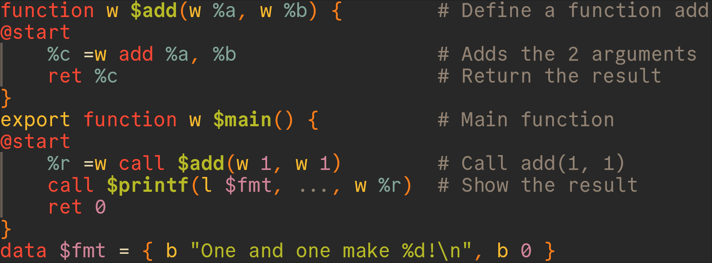
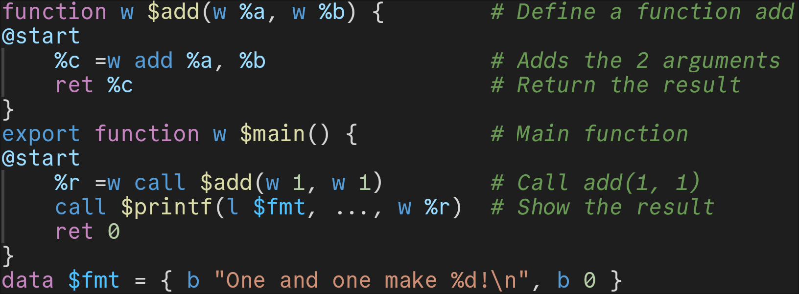
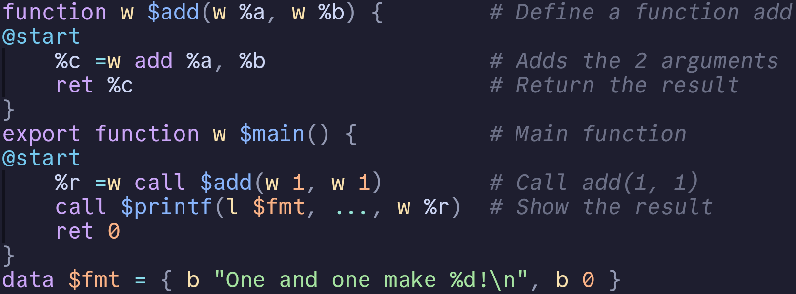
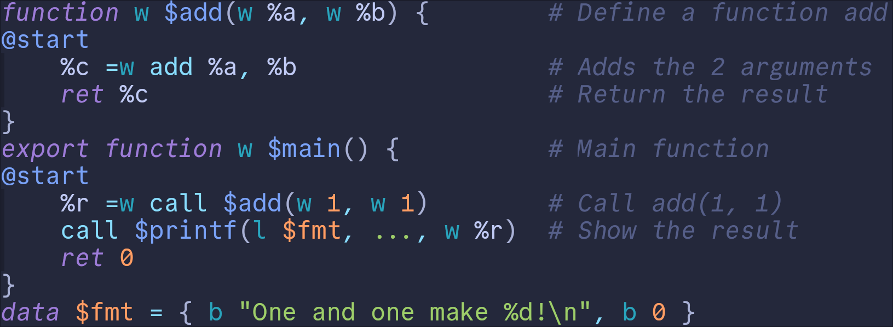

# Treesitter grammar for the QBE Intermediate Language

[QBE](https://c9x.me/compile/) is a relatively simple compiler backend with an easy to learn intermediate language.

Here is an example of the intermediate language:

```qbe
function w $add(w %a, w %b) {        # Define a function add
@start
    %c =w add %a, %b                 # Adds the 2 arguments
    ret %c                           # Return the result
}
export function w $main() {          # Main function
@start
    %r =w call $add(w 1, w 1)        # Call add(1, 1)
    call $printf(l $fmt, ..., w %r)  # Show the result
    ret 0
}
data $fmt = { b "One and one make %d!\n", b 0 }
```

## Showcase

Here are some screenshots with syntax highlighting in Neovim:

### Gruvbox theme:


### VSCode theme:


### Catppuccin theme:


### Tokyonight theme:

